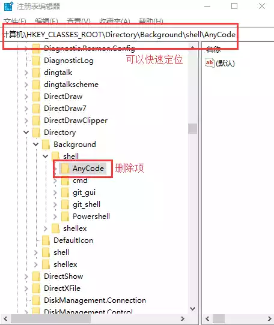

# Windows 删除右键菜单

1. 打开注册表编辑器：windows+R 打开运行，输入 regedit 命令。
2. 定位 `HKEY_CLASSES_ROOT\Directory\Background\shell` 以及 `HKEY_CLASSES_ROOT\Directory\shell` 删除

以下是删除 visual studio 的右键菜单演示



快速复制抵达：

```
regedit
```

```
\HKEY_CLASSES_ROOT\Directory\Background\shell
```

```
\HKEY_CLASSES_ROOT\Directory\shell
```
