# Linux 学习笔记

## Linux 的文件系统结构

在 Ubuntu（以及其他 Unix-like 系统）中，所有的文件和目录都组织在一个单一的、层次化的目录结构中，这被称为文件系统。文件系统的根是 `/`，所有文件夹和目录都挂载在这个根目录下。

- `/bin`：这个目录下通常没有子目录，只包含可执行文件（命令）。
- `/boot`：包含 `grub`（启动加载器的配置文件）和各种内核文件。
- `/dev`：包含各种设备文件，如 `sda`（硬盘）、`tty`（终端）等。
- `/etc`：包含各种配置文件和子目录，如 `apache2`（Apache 服务器的配置文件）、`ssh`（SSH 的配置文件）等。
- `/home`：每个用户都有一个子目录，子目录的名字就是用户名。
- `/lib`：包含各种库文件和子目录，如 `systemd`（系统服务的库文件）等。
- `/media`：当你插入一个可移动媒体设备（如 USB 设备）时，系统会在这个目录下创建一个子目录作为设备的挂载点。
- `/mnt`：你可以在这个目录下创建子目录，然后将临时文件系统挂载到这些子目录上。
- `/opt`：每个可选的应用软件包通常都有一个子目录，子目录的名字就是软件包的名字。
- `/proc`：这个目录下的子目录和文件都是虚拟的，用于访问内核和进程状态信息。
- `/root`：这个目录下的子目录和文件都属于 root 用户。
- `/sbin`：这个目录下通常没有子目录，只包含可执行文件（命令）。
- `/srv`：这个目录下的子目录结构通常会根据服务器应用的需求而变化。
- `/sys`：这个目录下的子目录和文件都是虚拟的，用于访问和修改内核的设备和驱动信息。
- `/tmp`：这个目录下的子目录和文件都是临时的，系统重启时会被清空。
- `/usr`：这个目录下包含各种子目录，如 `bin`（用户级别的可执行文件）、`lib`（用户级别的库文件）、`share`（共享数据）等。
- `/var`：这个目录下包含各种子目录，如 `log`（日志文件）、`mail`（邮件队列）、`www`（网页文件）等。

这些只是一些常见的子目录，具体的子目录可能会根据你的系统配置和使用情况而变化。

## 文件树结构简图

```mermaid
graph TB
  / --> |"bin"| Bin[二进制可执行文件]
  / --> |"boot"| Boot[启动加载器文件]
  / --> |"dev"| Dev[设备文件]
  / --> |"etc"| Etc[配置文件]
  / --> |"home"| Home[用户主目录]
  / --> |"lib"| Lib[共享库文件]
  / --> |"media"| Media[可移除媒体]
  / --> |"mnt"| Mnt[临时挂载点]
  / --> |"opt"| Opt[可选的应用软件包]
  / --> |"proc"| Proc[进程信息虚拟文件系统]
  / --> |"root"| RootDir[超级用户的主目录]
  / --> |"run"| Run[运行时数据]
  / --> |"sbin"| Sbin[系统管理二进制可执行文件]
  / --> |"srv"| Srv[服务数据]
  / --> |"sys"| Sys[设备和系统信息]
  / --> |"tmp"| Tmp[临时文件]
  / --> |"usr"| Usr[用户程序和数据]
  / --> |"var"| Var[可变数据]
```



由上图可看出，所有文件夹都挂载在 `/` 目录下。

## Linux 的命令

当你登录 Ubuntu 系统后，你通常会在你的家目录下。每个用户都有一个家目录，用于存储用户的个人文件。家目录的路径通常是 `/home/用户名`，例如，如果你的用户名是 `john`，那么你的家目录就是 `/home/john`。

你可以使用 `pwd` 命令（print working directory，打印工作目录）来查看你当前所在的目录。例如：

```bash
pwd
```

这个命令会在终端中显示你当前所在的目录的路径。

## man 命令

`man` 命令是 Linux 系统中的一个命令，用于查看命令或程序的文档。你可以使用 `man` 命令来查看任何命令或程序的文档，包括系统命令和用户自定义的程序。

要查看 `man` 命令的文档，你可以使用以下命令：

```bash
man man
```
这将显示 `man` 命令的文档。

你还可以使用 `man` 命令来查看其他命令或程序的文档，例如：

```bash
man ls
```
这将显示 `ls` 命令的文档。

要退出文档，你可以按 `q` 键。

## sudo 命令

`sudo` 是一个 Linux 命令，全称是 "Super User Do"。它允许普通用户执行需要超级用户（也就是 root 用户）权限的命令。

当你在一个命令前面加上 `sudo`，系统会要求你输入你的密码，然后这个命令就会以超级用户的身份执行。这是一种安全机制，可以防止用户无意中执行可能会破坏系统的命令。

例如，如果你想要安装一个新的软件包，你可能需要使用 `sudo` 命令，因为这通常需要超级用户权限：

```bash
sudo apt install example-package
```

在这个例子中，`sudo` 命令让你以超级用户的身份运行 `apt install example-package` 命令。

请注意，不是所有的用户都可以使用 `sudo` 命令。只有在 sudoers 文件中列出的用户或用户组才可以使用 `sudo` 命令。

## cd 命令

在 Ubuntu 系统中，你可以使用 `cd` 命令（change directory，改变目录）来跳转到其他目录。例如，如果你想跳转到 `/etc` 目录，你可以输入以下命令：

```bash
cd /etc
```

如果你想跳转到你的家目录，你可以使用 `cd` 命令，后面不跟任何参数：

```bash
cd
```

你也可以使用 `~` 符号来表示你的家目录。例如，如果你想跳转到你的家目录下的 `Documents` 目录，你可以输入以下命令：

```bash
cd ~/Documents
```

在 Ubuntu 系统中，你可以使用 `cd` 命令（change directory，改变目录）来跳转到其他目录。如果你想跳转到 `/` 目录，你可以输入以下命令：

```bash
cd /
```

这个命令会将你的工作目录切换到 `/` 目录。

请注意，目录路径可以是绝对路径，也可以是相对路径。绝对路径是从根目录 `/` 开始的路径，相对路径是从当前目录开始的路径。例如，如果你当前在 `/etc` 目录，你可以使用相对路径来跳转到 `/etc/apache2` 目录：

```bash
cd apache2
```

## touch 命令

在 Ubuntu 系统中，你可以使用 `touch` 命令来创建一个新的空文件。例如，如果你想创建一个名为 `example.txt` 的文件，你可以输入以下命令：

```bash
touch example.txt
```

这个命令会在当前目录下创建一个名为 `example.txt` 的新文件。如果文件已经存在，`touch` 命令不会覆盖原有的文件，而是更新文件的访问和修改时间。

如果你想在其他目录下创建文件，你可以在文件名前面加上目录的路径。例如，如果你想在 `/tmp` 目录下创建一个名为 `example.txt` 的文件，你可以输入以下命令：

```bash
touch /tmp/example.txt
```

请注意，如果目录不存在或者你没有权限在该目录下创建文件，这个命令会失败，并在终端中显示一个错误消息。

## vim 的退出命令

在 Vim 编辑器中，你可以使用以下步骤来退出：

1. 首先，确保你处于命令模式。如果你正在插入模式或其他模式，按 `Esc` 键可以回到命令模式。

2. 在命令模式下，输入 `:q`，然后按 `Enter` 键。这将退出 Vim。

如果你已经修改了文件，Vim 会阻止你退出，除非你保存修改或者明确告诉 Vim 放弃修改。以下是一些相关的命令：

- `:wq`：保存修改，然后退出 Vim。
- `:q!`：不保存修改，强制退出 Vim。
- `:wq!`：保存修改，强制退出 Vim。

请注意，所有这些命令都需要在命令模式下输入。

## mkdir 命令

在 Ubuntu 系统中，你可以使用 `mkdir` 命令来创建一个新的目录。例如，如果你想创建一个名为 `example` 的目录，你可以输入以下命令：

```bash
mkdir example
```

这个命令会在当前目录下创建一个名为 `example` 的目录。如果你想在其他目录下创建目录，你可以在目录名前面加上目录的路径。例如，如果你想在 `/tmp` 目录下创建一个名为 `example` 的目录，你可以输入以下命令：

```bash
mkdir /tmp/example
```

请注意，如果目录已经存在或者你没有权限在该目录下创建目录，这个命令会失败，并在终端中显示一个错误消息。

## cp 命令

在 Ubuntu 系统中，你可以使用 `cp` 命令来复制文件和目录。例如，如果你想将一个名为 `example.txt` 的文件复制到当前目录下的一个名为 `example` 的目录中，你可以输入以下命令：

```bash
cp example.txt example
```

这个命令会在当前目录下创建一个名为 `example` 的目录，并将 `example.txt` 文件复制到该目录中。如果你想在其他目录下复制文件或目录，你可以在文件名或目录名前面加上目录的路径。例如，如果你想将一个名为 `example.txt` 的文件复制到 `/tmp` 目录下的一个名为 `example` 的目录中，你可以输入以下命令：

```bash
cp /tmp/example.txt /tmp/example
```

请注意，`cp` 命令会复制文件或目录，而不会在目标位置创建一个新的文件或目录。如果你想在目标位置创建一个新的文件或目录，你可以使用 `-r`（或 `--recursive`）选项。例如，如果你想将一个名为 `example` 的目录及其中的所有文件和子目录复制到 `/tmp` 目录下的一个名为 `example` 的目录中，你可以输入以下命令：

```bash
cp -r example /tmp
```

请注意，`cp` 命令会复制文件和目录，而不会复制它们的权限、所有者和组。如果你需要复制文件的权限、所有者和组，你可以使用 `-p`（或 `--preserve`）选项。

## mv 命令
在 Ubuntu 系统中，你可以使用 `mv` 命令来移动文件和目录。例如，如果你想将一个名为 `example.txt` 的文件移动到当前目录下的一个名为 `example` 的目录中，你可以输入以下命令：

```bash
mv example.txt example
```

这个命令会将 `example.txt` 文件移动到当前目录下的一个名为 `example` 的目录中。如果你想在其他目录下移动文件或目录，你可以在文件名或目录名前面加上目录的路径

例如，如果你想将一个名为 `example.txt` 的文件移动到 `/tmp` 目录下的一个名为 `example` 的目录中

你可以输入以下命令：

```bash
mv /tmp/example.txt /tmp/example
```

这个命令会将 `example.txt` 文件移动到 `/tmp` 目录下的一个名为 `example` 的目录中。如果你想在目标位置创建一个新的文件或目录，你可以使用 `-r`（或 `--recursive`）选项。例如，如果你想将一个名为 `example` 的目录及其中的所有文件和子目录移动到 `/tmp` 目录下的一个名为 `example` 的目录中，你可以输入以下命令：

```bash
mv -r example /tmp
```

## cat 命令
在 Ubuntu 系统中，你可以使用 `cat` 命令来查看文件的内容。例如，如果你想查看一个名为 `example.txt` 的文件的内容

你可以输入以下命令：

```bash
cat example.txt
```

这个命令会输出 `example.txt` 文件的内容到终端上。如果你想在其他目录下查看文件的内容，你可以在文件名前面加上目录的路径

例如，如果你想查看 `/tmp` 目录下的一个名为 `example.txt` 的文件的内容

你可以输入以下命令：

```bash
cat /tmp/example.txt
```

这个命令会输出 `/tmp/example.txt` 文件的内容到终端上。

## rm 命令

在 Ubuntu 系统中，你可以使用 `rm` 命令来删除文件和目录。

- 删除文件：如果你想删除一个名为 `example.txt` 的文件，你可以输入以下命令：

  ```bash
  rm example.txt
  ```

- 删除目录：如果你想删除一个名为 `example` 的目录，你需要使用 `-r`（或 `--recursive`）选项来递归删除目录和目录中的文件。例如：

  ```bash
  rm -r example
  ```

请注意，`rm` 命令会永久删除文件和目录，不会将它们移动到回收站。如果你删除了一个文件或目录，你将无法恢复它。因此，使用 `rm` 命令时需要特别小心。

## ls 命令

在 Ubuntu 系统中，你可以使用 `ls` 命令来列出一个目录下的所有文件和目录。例如，如果你想查看当前目录下的所有文件和目录，你可以输入以下命令：

```bash
ls
```

如果你想查看其他目录下的所有文件和目录，你可以在 `ls` 命令后面加上目录的路径。例如，如果你想查看 `/etc` 目录下的所有文件和目录，你可以输入以下命令：

```bash
ls /etc
```

你还可以使用 `-l` 选项来查看文件和目录的详细信息，包括文件大小、文件修改时间和文件权限。例如：

```bash
ls -l
```

这个命令会以列表的形式显示当前目录下的所有文件和目录的详细信息。

## ps 命令

在 Ubuntu 系统中，你可以使用 `ps` 命令来查看当前正在运行的进程。例如，你可以输入以下命令来查看所有的进程：

```bash
ps aux
```

这个命令会显示一个列表，列出了所有正在运行的进程的详细信息，包括进程 ID、进程的状态、CPU 使用率、内存使用率、运行进程的用户等。

如果你只对某个特定的进程感兴趣，你可以使用 `grep` 命令来过滤结果。例如，如果你想查看所有名为 `example` 的进程，你可以输入以下命令：

```bash
ps aux | grep example
```

这个命令会显示所有名为 `example` 的进程。

## kill 命令

在 Ubuntu 系统中，你可以使用 `kill` 命令来停止一个进程。`kill` 命令需要一个进程 ID（PID）作为参数。

以下是使用 `kill` 命令停止进程的基本步骤：

1. 首先，你需要知道你想要停止的进程的 PID。你可以使用 `ps` 命令来查看所有正在运行的进程和它们的 PID。例如，如果你想查看所有名为 `example` 的进程，你可以输入以下命令：

   ```bash
   ps aux | grep example
   ```

2. 然后，你可以使用 `kill` 命令来停止进程。例如，如果你想停止 PID 为 1234 的进程，你可以输入以下命令：

   ```bash
   kill 1234
   ```

请注意，你需要替换 1234 为你想要停止的进程的 PID。你可能需要输入你的密码，因为 `kill` 命令可能需要管理员权限。

如果 `kill` 命令不能停止一个进程，你可以使用 `-9` 选项来强制停止进程。例如：

```bash
kill -9 1234
```

这个命令会强制停止 PID 为 1234 的进程。

## shutdown 命令

在 Linux 系统中，你可以使用 `shutdown` 命令来关机。以下是一些常见的使用方式：

1. 立即关机：

   ```bash
   sudo shutdown now
   ```

2. 在特定的时间关机，例如在 10 分钟后：

   ```bash
   sudo shutdown +10
   ```

3. 在特定的时刻关机，例如在今天的 23:00：

   ```bash
   sudo shutdown 23:00
   ```

请注意，`shutdown` 命令需要管理员权限，所以你需要使用 `sudo` 命令。

另外，你也可以使用 `poweroff` 命令来立即关机：

```bash
sudo poweroff
```

这些命令在大多数 Linux 发行版中都应该可以工作。

## reboot 命令

在 Linux 系统中，你可以使用 `reboot` 命令来重启计算机。以下是一些常见的使用方式：

1. 立即重启：

   ```bash
   sudo reboot
   ```

2. 在特定的时间重启，例如在 10 分钟后：

   ```bash
   sudo reboot +10
   ```

3. 在特定的时刻重启，例如在今天的 23:00：

   ```bash
   sudo reboot 23:00
   ```

请注意，`reboot` 命令需要管理员权限，所以你需要使用 `sudo` 命令。

这些命令在大多数 Linux 发行版中都应该可以工作。

## date 命令
在 Linux 系统中，你可以使用 `date` 命令来查看或设置系统时间。以下是一些常见的使用方式：

1. 立即显示当前时间：

   ```bash
   date
   ```

2. 设置系统时间为当前时间加 1 小时：

   ```bash
   date -s "1 hour ago"
   ```

3. 设置系统时间为指定的时间，例如 2022-01-01 00:00:00：

   ```bash
   date -s "2022-01-01 00:00:00"
   ```

请注意，`date` 命令需要管理员权限，所以你需要使用 `sudo` 命令。

## top 命令

在 Linux 系统中，你可以使用 `top` 命令来查看系统资源的使用情况。以下是一些常见的使用方式：

1. 立即显示 `top` 命令的输出：

   ```bash
   top
   ```

2. 每秒更新一次 `top` 命令的输出：

   ```bash
   top -d 1
   ```

3. 显示每个进程的详细信息：

   ```bash
   top -o %MEM
   ```

请注意，`top` 命令会持续显示系统资源的使用情况，直到你按下 `q` 键退出。

## 解压缩命令

1. 压缩一个文件夹：

    ```bash
    tar -czf archive.tar.gz /path/to/your/directory
    ```

    这个命令会将 `/path/to/your/directory` 文件夹压缩成一个 `archive.tar.gz` 文件。

2. 压缩多个文件：

    ```bash
    tar -czf archive.tar.gz /path/to/file1 /path/to/file2
    ```

    这个命令会将 `/path/to/file1` 和 `/path/to/file2` 压缩成一个 `archive.tar.gz` 文件。

在这些命令中，`-czf` 是 `tar` 命令的选项：

- `-c` 表示创建新的归档文件。
- `-z` 表示使用 gzip 进行压缩。
- `-f` 表示后面跟着的是要创建的归档文件名。

请将 `/path/to/your/directory`、`/path/to/file1`、`/path/to/file2` 和 `archive.tar.gz` 替换为你实际的文件或目录路径和归档文件名。

在Linux中，有多种命令可以用来压缩和解压缩文件。以下是一些常用的压缩命令：

1. **gzip**：这是一个常用的压缩工具，它使用GZIP算法。你可以使用`gzip filename`来压缩一个文件，使用`gunzip filename.gz`来解压缩一个文件。

   ```bash
   gzip filename
   gunzip filename.gz
   ```

2. **bzip2**：这是另一个压缩工具，它使用BZIP2算法，通常可以提供比GZIP更好的压缩率。你可以使用`bzip2 filename`来压缩一个文件，使用`bunzip2 filename.bz2`来解压缩一个文件。

   ```bash
   bzip2 filename
   bunzip2 filename.bz2
   ```

3. **zip/unzip**：这是一对用来创建和解压缩ZIP文件的命令。你可以使用`zip archive.zip filename`来创建一个ZIP文件，使用`unzip archive.zip`来解压缩一个ZIP文件。

   ```bash
   zip archive.zip filename
   unzip archive.zip
   ```

4. **tar**：这是一个用来创建和解压缩tar文件的命令。虽然tar本身不提供压缩功能，但是它可以与gzip或bzip2等压缩工具一起使用。你可以使用`tar czf archive.tar.gz filename`来创建一个GZIP压缩的tar文件，使用`tar xzf archive.tar.gz`来解压缩一个tar文件。

   ```bash
   tar czf archive.tar.gz filename
   tar xzf archive.tar.gz
   ```

这些只是一些基本的压缩命令，实际上每个命令都有许多选项和参数可以用来调整它的行为。你可以使用`man`命令来查看每个命令的详细信息，例如`man gzip`。

## dpkg 命令

在 Ubuntu 系统中，你可以使用 `dpkg` 命令来查看已安装的软件包。`dpkg` 是 Debian 和 Ubuntu 系统的软件包管理工具。你可以使用 `-l` 选项来列出所有已安装的软件包。例如：

```bash
dpkg -l
```

这个命令会显示一个列表，列出了你的系统中所有已安装的软件包，包括软件包的名称、版本、架构和描述。

如果你只对某个特定的软件包感兴趣，你可以使用 `grep` 命令来过滤结果。例如，如果你想查看是否安装了 `vim`，你可以输入以下命令：

```bash
dpkg -l | grep vim
```

这个命令会显示所有名称中包含 `vim` 的软件包。

## apt 命令

在 Ubuntu 系统中，你可以使用 `apt` 命令来卸载软件。`apt` 是 Ubuntu 的软件包管理工具，可以用来安装、更新和删除软件包。

以下是使用 `apt` 命令卸载软件的基本步骤：

1. 首先，你需要知道你想要卸载的软件包的准确名称。你可以使用 `dpkg -l` 命令来查看所有已安装的软件包。

2. 然后，你可以使用 `apt remove` 命令来卸载软件。例如，如果你想卸载一个名为 `example` 的软件包，你可以输入以下命令：

   ```bash
   sudo apt remove example
   ```

请注意，你需要替换 `example` 为你想要卸载的软件包的名称。你可能需要输入你的密码，因为 `sudo` 命令需要管理员权限。

如果你想完全卸载一个软件包，包括它的配置文件，你可以使用 `apt purge` 命令。例如：

```bash
sudo apt purge example
```

这个命令会卸载 `example` 软件包，并且删除它的配置文件。

## 查看安装的软件

在 Linux 系统中，你可以使用包管理器来查看已安装的软件包。不同的 Linux 发行版可能使用不同的包管理器。以下是一些常见的包管理器和相应的命令：

- 在使用 `apt` 的系统（如 Ubuntu、Debian）中，你可以使用以下命令：

    ```bash
    dpkg --get-selections
    ```

- 在使用 `yum` 的系统（如 CentOS、RHEL）中，你可以使用以下命令：

    ```bash
    yum list installed
    ```

- 在使用 `dnf` 的系统（如 Fedora）中，你可以使用以下命令：

    ```bash
    dnf list installed
    ```

- 在使用 `pacman` 的系统（如 Arch Linux）中，你可以使用以下命令：

    ```bash
    pacman -Q
    ```

这些命令会列出你的系统中已安装的所有软件包。如果你只想查找特定的软件包，你可以将这些命令的输出通过 `grep` 命令进行过滤。例如，以下命令会查找所有包含 `python` 的软件包：

```bash
dpkg --get-selections | grep python
```

### deinstall 是什么意思

在使用 `dpkg --get-selections` 命令查看已安装软件包时，你可能会看到某些软件包的状态被标记为 `deinstall`。

`deinstall` 状态表示该软件包已被标记为待卸载，但其配置文件仍保留在系统中。这意味着虽然软件包的可执行文件和库已被删除，但其配置文件仍然存在。如果你在后续重新安装该软件包，这些配置文件将会被重用。

如果你想完全删除一个软件包，包括其配置文件，你可以使用 `apt-get purge` 命令（在使用 `apt` 的系统中）或 `yum remove` 命令并加上 `--remove-leaves` 选项（在使用 `yum` 的系统中）。例如：

```bash
sudo apt-get purge packagename
```

请将 `packagename` 替换为你想要删除的软件包的名称。

## 查看文件详情

在Linux中，你可以使用`ls`命令的`-l`选项来查看文件的详细信息。例如：

```bash
ls -l filename
```

这个命令会显示`filename`的详细信息，包括：

- 文件类型和权限
- 链接数
- 文件所有者
- 文件所属的组
- 文件大小
- 最后修改时间
- 文件名

你可以替换`filename`为你实际要查看的文件的名称。

此外，你还可以使用`file`命令来查看文件的类型，例如：

```bash
file filename
```

这个命令会显示`filename`的类型。

你还可以使用`stat`命令来查看文件的所有状态信息，包括文件的大小、块数、inode号、权限、所有者、组、设备、硬链接数、最后访问时间、最后修改时间、最后状态改变时间等，例如：

```bash
stat filename
```

这个命令会显示`filename`的所有状态信息。

```bash
  File: filekey.bin
  Size: 1048576         Blocks: 2048       IO Block: 4096   regular file
Device: fc03h/64515d    Inode: 270696      Links: 1
Access: (0664/-rw-rw-r--)  Uid: ( 1000/   admin)   Gid: ( 1000/   admin)
Access: 2024-02-14 11:22:43.321543138 +0800
Modify: 2024-02-14 11:22:43.321543138 +0800
Change: 2024-02-14 11:22:43.321543138 +0800
 Birth: 2024-02-14 11:22:43.321543138 +0800
```

解释：这是Linux中`stat`命令的输出，表示`filekey.bin`文件的详细状态信息。每一部分的含义如下：

- `File: filekey.bin`：这是文件的名称。

- `Size: 1048576`：这是文件的大小，单位是字节。这里是 `1048576`，表示文件大小是1MB（1024\*1024字节）。

- `Blocks: 2048`：这是文件占用的磁盘块数。一个块通常包含512字节。

- `IO Block: 4096`：这是文件系统的I/O块大小。这是文件系统进行数据读写的单位。

- `Device: fc03h/64515d`：这是包含文件的设备的设备号。

- `Inode: 270696`：这是文件的inode号。在Unix和Linux系统中，inode是文件系统中的一个数据结构，用于存储文件的元数据。

- `Links: 1`：这是文件的硬链接数。硬链接是文件系统中的一个引用，指向文件的物理位置。

- `Access: (0664/-rw-rw-r--)  Uid: ( 1000/   admin)   Gid: ( 1000/   admin)`：这是文件的权限、所有者和所属组。`0664`是文件权限的八进制表示，`-rw-rw-r--`是文件权限的符号表示，`Uid: ( 1000/   admin)`是文件所有者的用户ID和用户名，`Gid: ( 1000/   admin)`是文件所属组的组ID和组名。

- `Access: 2024-02-14 11:22:43.321543138 +0800`：这是文件最后访问的时间。

- `Modify: 2024-02-14 11:22:43.321543138 +0800`：这是文件最后修改的时间。

- `Change: 2024-02-14 11:22:43.321543138 +0800`：这是文件状态最后改变的时间。

- `Birth: 2024-02-14 11:22:43.321543138 +0800`：这是文件的创建时间。注意，并非所有的文件系统都支持记录文件的创建时间。

## 文件命令
1. **查看文件内容**:
   - `cat file.txt`: 显示整个文件的内容。
   - `less file.txt` 或 `more file.txt`: 分页查看文件内容，`less`允许向前向后翻页，而`more`只能向前翻页。
   - `head -n 5 file.txt`: 显示文件的前5行。
   - `tail -n 5 file.txt`: 显示文件的最后5行。
   - `grep 'pattern' file.txt`: 在文件中搜索包含特定模式（pattern）的行。

2. **编辑文件**:
   - `vim file.txt` 或 `vi file.txt`: 使用Vim文本编辑器打开文件进行编辑。Vim是一个功能强大的编辑器，提供多种模式进行文本编辑。
   - `nano file.txt`: 使用Nano编辑器，它是一个较为简单直观的文本编辑器，适合初学者。

3. **文件内容处理**:
   - `sed`: 流编辑器，可以对文本文件进行查找、替换等操作。例如，`sed 's/old/new/g' file.txt` 将文件中所有`old`替换为`new`。
   - `awk`: 强大的文本分析工具，可以用来格式化文本、提取字段等。例如，`awk '{print $1}' file.txt` 打印每行的第一个字段。

4. **文件状态和操作**:
   - `wc file.txt`: 统计文件的行数、单词数和字节数。
   - `mv old.txt new.txt`: 重命名或移动文件。
   - `cp file.txt destination`: 复制文件到指定位置。
   - `rm file.txt`: 删除文件。

5. **文件权限与所有权管理**:
   - `chmod`: 修改文件权限，如 `chmod 755 file.txt` 设置文件可执行权限。
   - `chown`: 改变文件的所有者，如 `chown user:group file.txt`。

## 重置服务器密码

在 Linux 服务器上，你可以使用 `passwd` 命令来更改用户的密码。以下是一个示例：

```bash
sudo passwd username
```

在这个命令中：

- `sudo`是一个命令，用于以超级用户的权限运行命令。更改用户的密码通常需要超级用户的权限。
- `passwd`是一个命令，用于更改用户的密码。
- `username`是你要更改密码的用户的用户名。你应该将它替换为实际的用户名。

运行这个命令后，你会被提示输入新的密码。你应该输入一个强密码，然后确认。

注意，这只是一个示例。实际使用时，你应该根据你的具体需求和环境选择合适的命令。如果你不是超级用户，你可能需要联系你的系统管理员来更改密码。

## 查看 Linux 的所有用户

在Linux中，你可以通过查看`/etc/passwd`文件来查看系统中的所有用户。`/etc/passwd`文件包含了系统中每个用户的信息。你可以使用`cat`或`less`命令来查看这个文件的内容。以下是一个示例：

```bash
cat /etc/passwd
```

每一行代表一个用户，字段之间由冒号分隔。第一个字段是用户名。

如果你只想知道用户的数量，你可以使用`wc`命令来计数。以下是一个示例：

```bash
cat /etc/passwd | wc -l
```

这个命令会输出`/etc/passwd`文件中的行数，也就是用户的数量。

注意，这只是一个示例。实际使用时，你应该根据你的具体需求和环境选择合适的命令。

## 列出当前登录的用户

在Linux中，你可以使用`who`命令来列出当前登录的用户。以下是一个示例：

```bash
who
```

`who`命令会显示每个登录用户的用户名、终端名、登录时间等信息。

如果你只想看到用户名，你可以使用`who`命令的`-q`选项。以下是一个示例：

```bash
who -q
```

这个命令会只显示登录用户的用户名。

注意，这只是一个示例。实际使用时，你应该根据你的具体需求和环境选择合适的命令。
